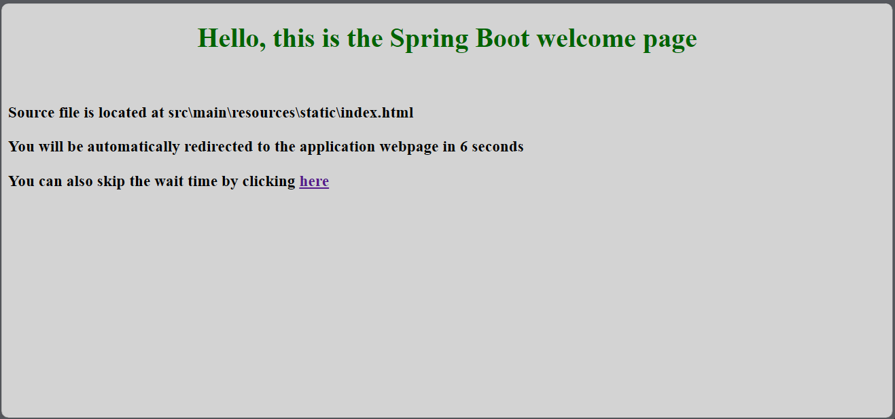
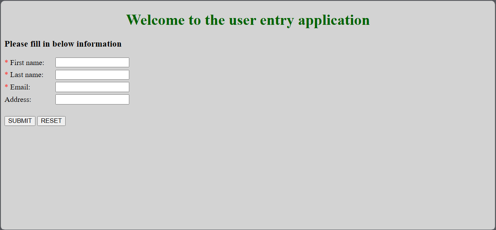
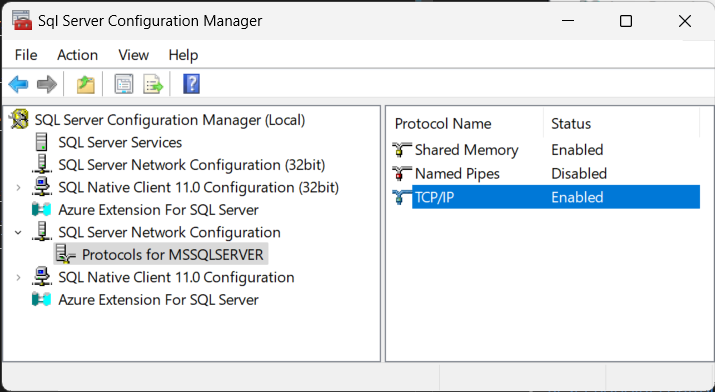
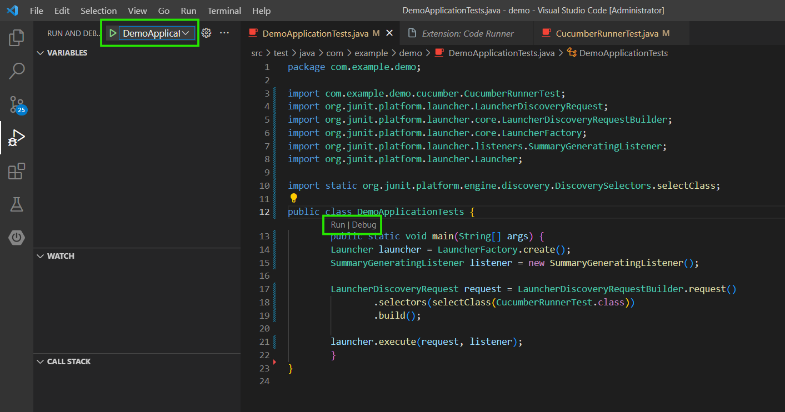
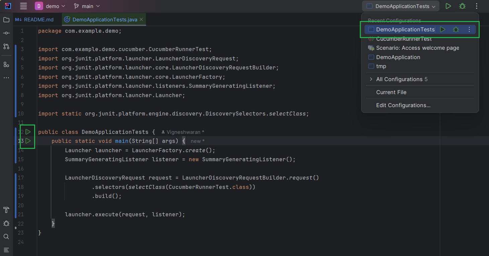
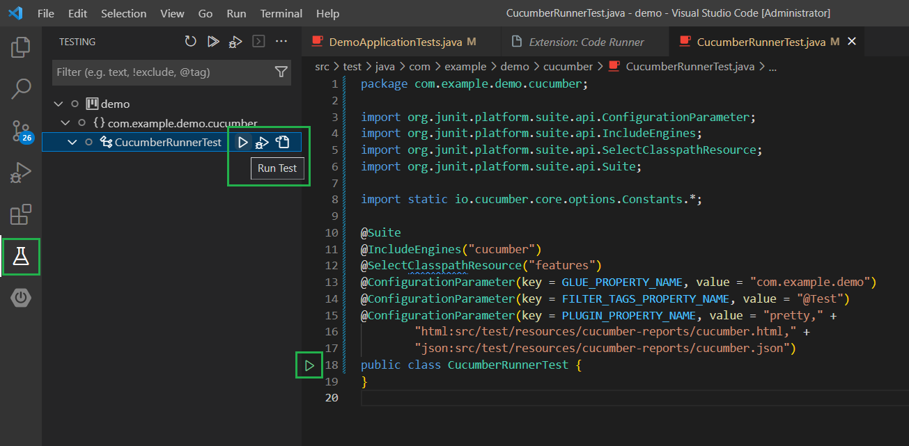
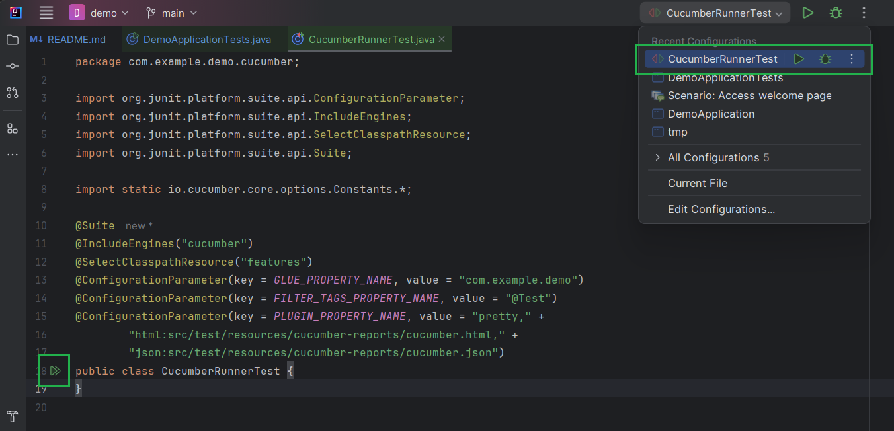
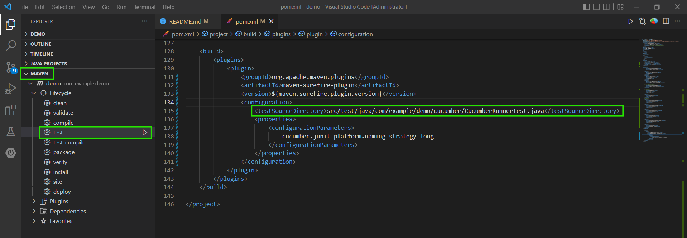
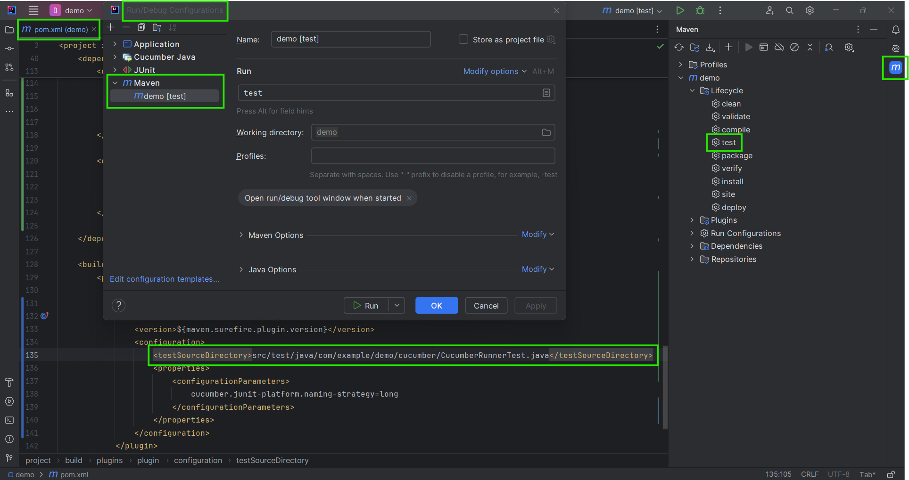

# SpringBoot Application

This is a simple Spring Boot application prepared for basic learning purpose.

## Getting Started

These instructions will get you a copy of the project up and running on your local machine for development and testing purposes.

### Prerequisites

- Java 8 or later [Currently I am using Java 17]
- IDE (VS Code, IntelliJ, or any)

### Installation

#### Key VS Code extension

- Java Support
    - Language Support for Java(TM) by Red Hat
    - Project Manager for Java
    - Extension Pack for Java
    - Debugger for Java
    - Maven for Java
- Spring Boot
    - Spring Boot Dashboard
    - Spring Boot Extension Pack
    - Spring Boot Tools
    - Spring Initializr Java Support
- Testing
    - Cucumber
- General
    - XML
    - IntelliCode
    - Code Runner
    - Prettier - Code formatter

## Usage

- Clone repository `git clone https://github.com/VigneshwaranSooriyamoorthy/SpringBootApplication.git`
- `mvn clean install` to synchronize all dependencies, to skip tests `mvn clean install -DskipTests`
- Open 'Spring Boot Dashboard' (VS Code)
- Run 'demo' application
- Navigate to http://localhost:8080 to access the webpage
  
  
- Only for MS SQL Server - Make sure to enable TCP/IP protocol from SQl Server Configuration
  Manager 

## Product Structure

### Backend

- [Spring Boot application](./src/main/java/com/example/demo/DemoApplication.java)
- [Data injection (Optional)](./src/main/java/com/example/demo/LoadSampleData.java)
- [Spring Boot Entity ~ DB table equivalent](./src/main/java/com/example/demo/User.java)
- [Rest endpoint controller](./src/main/java/com/example/demo/UserController.java)
- [Repository handler](./src/main/java/com/example/demo/UserRepository.java)
- [Spring Boot property file](./src/main/resources/application.yaml)
- [Spring Boot property file for H2](./src/main/resources/application-h2.yaml)
- [Spring Boot property file for MS SQL Server](./src/main/resources/application-mssql.yaml)

### Frontend

- [Webpage HTML](./src/main/resources/static/webpage/demo.html)
- [Support CSS](./src/main/resources/static/webpage/css/demo.css)
- [Support script](./src/main/resources/static/webpage/js)

### Testing

- [Feature files](./src/test/resources/features)
- [Test result - Cucumber reports](./target/cucumber-reports)
- [Test runner class - Java application](./src/test/java/com/example/demo/DemoApplicationTests.java)
- [JUnit - Cucumber runner class](./src/test/java/com/example/demo/cucumber/CucumberRunnerTest.java)

## Test Execution

- As Java application
    - `java -cp <classpath> com.example.demo.DemoApplicationTests`
    - VS Code
        - Open the java file
        - Right click > Run Java OR Use 'Run | Debug' (Ctrl+Shift+D)
          
    - IntelliJ
        - Open the java file
        - Use the runner button (Ctrl+Shift+F10)
          
- As JUnit
    
    - VS Code
        - Open the junit runner file
        - Use runner button OR 'Testing' sidebar
          
    - IntelliJ
        - Open the junit runner file
        - Use the runner button (Ctrl+Shift+F10)
          
- As Maven
    - `mvn test`
    - VS Code
      
    - IntelliJ
      
- To debug a specific test scenario
    - VS Code
        - Add any new tag to the test scenario
        - Update the parameter FILTER_TAGS_PROPERTY_NAME of [JUnit - Cucumber runner class](./src/test/java/com/example/demo/cucumber/CucumberRunnerTest.java)
        - Run CucumberRunnerTest (Refer section [Test Execution](#vscode-junit-runner))
    - IntelliJ (Easy approach)
        - Use the 'Run Test' icon displayed near to the scenario